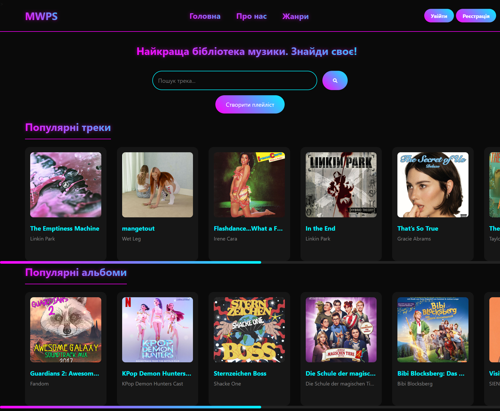
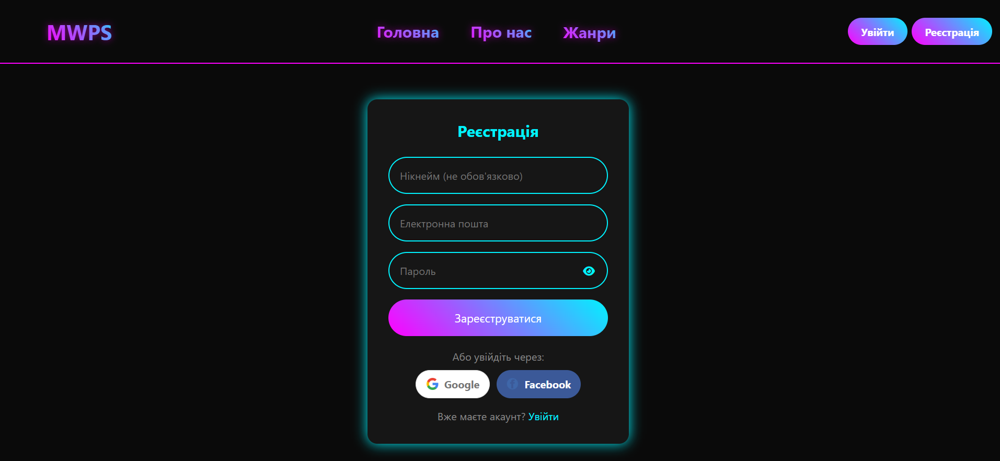
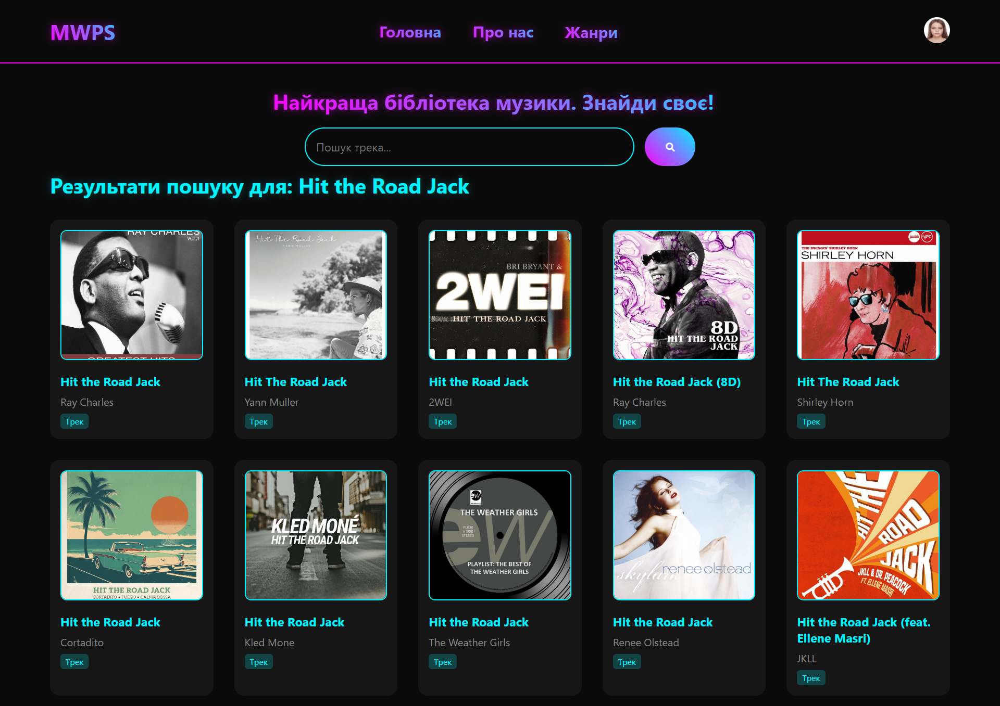
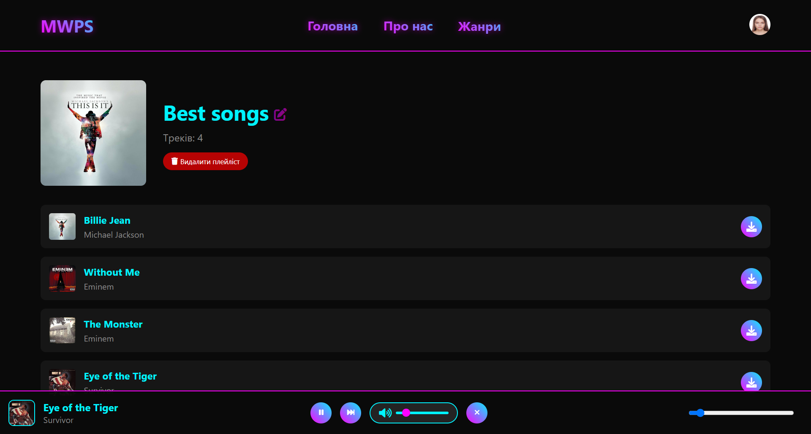
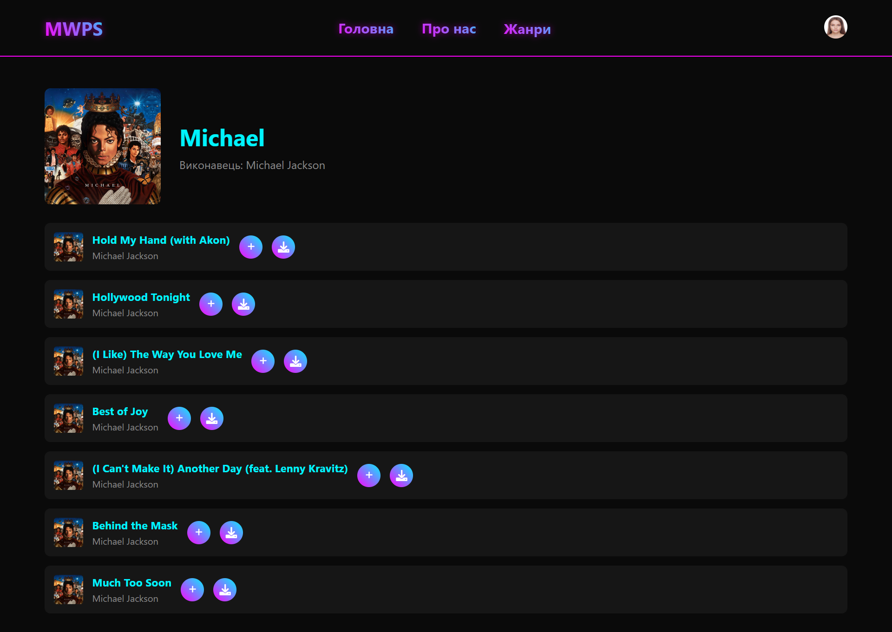
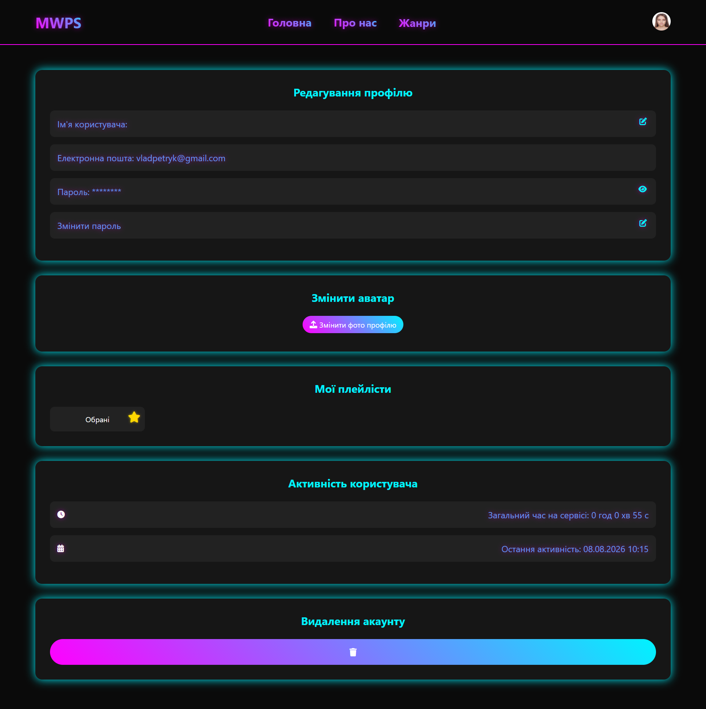

# 🎵 MWPS (Music Web Player Service)

**A full-stack music streaming web application** built with Flask, featuring user authentication, personal playlists, and real-time track/album search powered by the Deezer API.


---

## 📖 About the Project

**MusikWebApp** is a music discovery and library web platform that lets users search, browse, and listen to 30-second track previews sourced live from the **Deezer API**. Registered users can build and manage their own playlists, customize their profile, and track their listening activity — all backed by a self-built authentication system and a relational database.

The project was built to demonstrate a solid understanding of **backend web development, RESTful API integration, session-based authentication, and relational data modeling** in a real, working application (not just a tutorial clone).

---

## 📸 Preview

<!-- Add screenshots or a GIF demo of the app below -->
<p align="center">
  
</p>
<p align="center">
  
  
  
  
  
</p>
<p align="center">
  
</p>

---

## ✨ Key Features

- 🔍 **Search & Discovery** — search tracks and albums in real time via the Deezer API, browse popular tracks/albums and filter by genre
- 🔐 **Authentication System** — secure registration/login with hashed passwords, session management, and "remember me" support (Flask-Login)
- 🎶 **Playlists** — create, rename, and delete playlists; add or remove tracks with ownership checks on every action
- ▶️ **Track Previews** — instant 30-second audio previews and MP3 downloads for any track
- 👤 **User Profiles** — editable username, email, password, and avatar upload, plus account deletion
- 📊 **Activity Tracking** — tracks total time online and last active timestamp per user
- 💾 **Persistent Storage** — relational data model (users, playlists, tracks) via SQLAlchemy + SQLite
- ✅ **Code Quality** — enforced formatting and linting with Black, isort, and Flake8; covered by unit tests

---

## 🛠️ Tech Stack

| Layer            | Technology                                  |
|-------------------|----------------------------------------------|
| **Backend**       | Python, Flask                                |
| **Auth & Sessions**| Flask-Login, Werkzeug (password hashing)    |
| **Database / ORM**| SQLite, Flask-SQLAlchemy                     |
| **External API**  | Deezer API (via `requests`)                  |
| **Frontend**      | Jinja2 templates, HTML/CSS/JavaScript        |
| **Tooling**       | Black, isort, Flake8, unit tests             |

---

## 🏗️ Project Architecture

```
MusikWebApp/
├── app4.py              # Application entry point & route definitions
├── services/            # Deezer API integration layer
├── user_auth/           # Authentication logic & database models (User, Playlist, Track)
├── templates/            # Jinja2 HTML templates
├── static/               # CSS, JS, images, user avatars
├── tests/unit/            # Unit tests
├── pyproject.toml         # Code style & linting configuration
└── format.sh              # Formatting script
```

The codebase follows a clear **separation of concerns**: API calls are isolated in `services/`, authentication and data models live in `user_auth/`, and `app4.py` wires everything together through Flask routes — keeping the application easy to extend and maintain.

---

## 👨‍💻 Author

**Vladyslav Petryk**
[GitHub](https://github.com/PetrykVladyslav)

